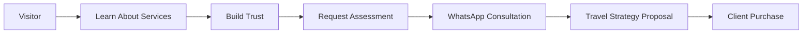
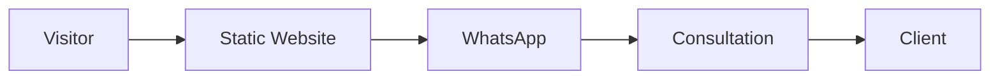
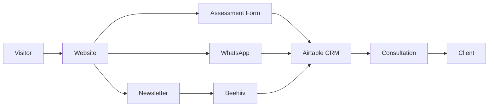
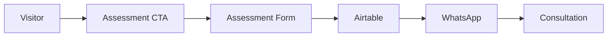
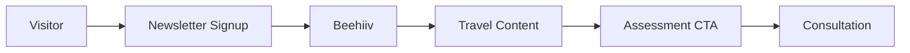
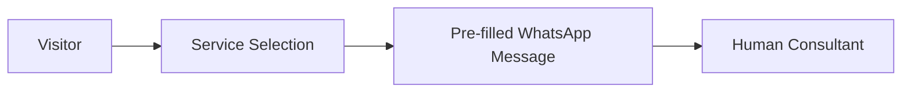

# Skyfare Consulting Website

Luxury Travel Concierge & Miles Redemption Consulting Platform

---

## Overview

Skyfare Consulting is a luxury travel concierge and miles redemption consulting service specializing in Business Class and First Class travel optimization.

The website serves as a marketing, lead generation, and client acquisition platform designed to educate travelers, build trust, and convert visitors into consultation requests.

Unlike traditional travel booking platforms, Skyfare operates as a concierge-based consulting service where travel strategies and redemption opportunities are customized for each client.

---

## Business Model



---

## Objectives

### Primary Goals

* Generate qualified consultation leads
* Increase WhatsApp inquiries
* Grow newsletter subscribers
* Build authority in luxury travel and miles redemption
* Convert visitors into paying clients

### Secondary Goals

* Educate travelers through premium content
* Showcase redemption opportunities
* Build long-term relationships through newsletter nurturing

---

## Technology Stack

### Frontend

* HTML5
* CSS3
* Vanilla JavaScript

### Hosting

* Static Hosting

### Current Integrations

* WhatsApp
* Beehiiv Newsletter
* Social Media Platforms
* Google Analytics 4
* Microsoft Clarity

---

## Current Architecture



### Advantages

* Fast performance
* Low maintenance
* Cost-effective hosting
* Simple deployment process

---

## Target Architecture



---

## Core Funnels

### Assessment Funnel



Purpose:

* Lead qualification
* Data collection
* Consultation preparation

---

### Newsletter Funnel



Purpose:

* Lead nurturing
* Audience growth
* Authority building

---

### WhatsApp Funnel



Purpose:

* Reduce friction
* Improve lead qualification
* Increase conversion rates

---

## Key Features

### Current Features

* Luxury travel service showcase
* Premium landing page experience
* WhatsApp consultation flow
* Newsletter integration
* Service-specific pages
* FAQ section
* Social media integration
* Responsive design

### Planned Features

* Newsletter archive
* Assessment forms
* Lead tracking
* Airtable CRM integration
* Case studies
* Advanced analytics
* Automation workflows

---

## Trust Building Strategy

### Priority 1

* Real redemption examples
* Case studies
* Travel success stories
* Transparent process explanations
* Comprehensive FAQs

### Priority 2

* Verified testimonials
* Video testimonials
* Client success stories

> Never use fabricated testimonials or fake reviews.

---

## Analytics & Tracking

### Google Analytics 4

Tracks:

* Website traffic
* User behavior
* CTA performance
* Conversion events
* Traffic sources

### Microsoft Clarity

Tracks:

* Session recordings
* Heatmaps
* Scroll depth
* User friction points

### Beehiiv Analytics

Tracks:

* Subscriber growth
* Open rates
* Click-through rates
* Newsletter performance

---

## Lead Management

### Recommended Platform

Airtable

Purpose:

* Lead storage
* Assessment tracking
* Consultation history
* Lead status management
* Reporting and visibility

Lead Workflow:

```text
New
↓
Contacted
↓
Proposal Sent
↓
Converted
↓
Closed
```

---

## Design Principles

### Brand Positioning

Luxury Travel Concierge

### Design Direction

* Premium
* Editorial
* Trustworthy
* Modern
* Minimal

### Motion Design

* GSAP animations
* Scroll storytelling
* Route visualizations
* Statistic counters
* Premium hover interactions
* Section reveals

### Avoid

* Excessive animations
* Startup gimmicks
* Cartoon-like visuals
* Agency-style portfolios

---

## Project Roadmap

### Phase 1 (Current)

Static Website
+
WhatsApp
+
Beehiiv
+
Analytics

Goal:

* Increase trust
* Generate leads
* Grow newsletter audience

---

### Phase 2

Static Website
+
Airtable CRM

Goal:

* Track leads
* Manage consultations
* Store customer history

---

### Phase 3

Airtable
+
Beehiiv
+
n8n Automation

Goal:

* Automate lead management
* Improve reporting
* Reduce manual workflows

---

### Phase 4

Optional Modernization

Potential Technologies:

* Supabase
* Custom Admin Dashboard
* WhatsApp Business API

Goal:

* Operational efficiency
* Scalability

---

## Out of Scope

The following are not currently planned:

* Online booking engine
* OTA-style flight search
* Customer login portal
* Mobile application
* AI chatbot
* Complex backend infrastructure

The current focus remains on lead generation, consultation acquisition, and authority building.

---

## Final Recommendation

Do not rebuild the website.

Continue leveraging:

* HTML
* CSS
* Vanilla JavaScript

Prioritize:

1. Lead Generation
2. Newsletter Growth
3. Case Studies
4. Analytics
5. Airtable CRM
6. Consultation Conversion

Introduce backend services only when operational requirements justify the additional complexity.
