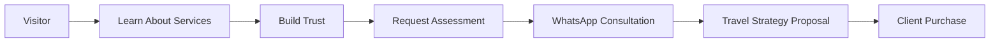
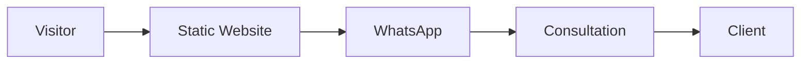
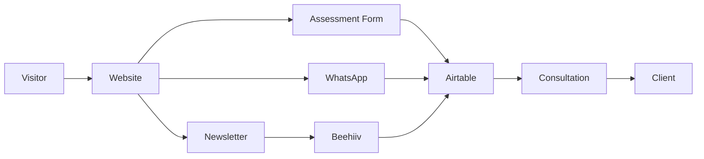
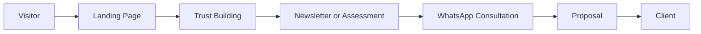
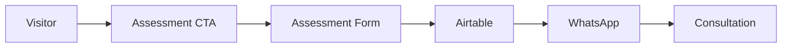
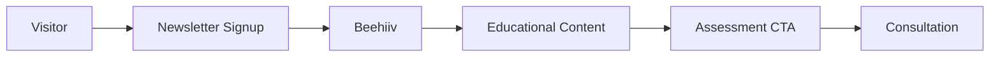
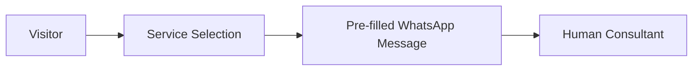

# Skyfare Consulting

## Website Architecture, Process Flow, and Strategic Roadmap

**Prepared for:** Skyfare Consulting
**Date:** June 20, 2026

---

# 1. Executive Summary

Skyfare Consulting is a luxury travel concierge and miles redemption consulting service specializing in Business Class and First Class travel optimization.

The website's primary purpose is not online booking, but:

* Lead Generation
* Trust Building
* Authority Building
* Client Acquisition
* Lead Nurturing

Skyfare operates as a concierge-based consulting business rather than a self-service booking platform.

### Business Model

The website should therefore prioritize conversion, education, trust, and consultation acquisition.

---

# 2. Business Objectives

## Primary Objectives

* Generate qualified travel consultation leads
* Increase WhatsApp inquiries
* Grow newsletter subscribers
* Establish authority in miles redemption and luxury travel
* Convert visitors into paying clients

## Success Metrics

### Marketing KPIs

* Website Traffic
* Newsletter Subscribers
* Newsletter Growth Rate
* Social Media Engagement

### Lead KPIs

* Assessment Requests
* WhatsApp Inquiries
* Consultation Bookings
* Qualified Leads

### Business KPIs

* Client Conversions
* Revenue Generated
* Repeat Clients
* Referral Clients

---

# 3. Current Architecture

## Technology Stack

### Frontend

* HTML
* CSS
* Vanilla JavaScript

### Hosting

* Static Hosting

### Current Integrations

* WhatsApp
* Social Media Platforms

### Current Limitations

* No lead database
* No CRM
* No centralized lead history
* No admin dashboard
* No automation workflows

---

# 4. Current vs Target Architecture

## Current State

### Strengths

* Fast
* Simple
* Low Maintenance
* Low Cost

### Weaknesses

* Limited lead visibility
* No lead history
* No nurturing process
* Limited analytics

---

## Target State

---

# 5. Recommended User Journey

This approach creates multiple opportunities to capture, nurture, and qualify leads before consultation.

---

# 6. Core Business Funnels

## Assessment Funnel

Purpose:

* Lead qualification
* Data collection
* Better consultation preparation

---

## Newsletter Funnel

Purpose:

* Long-term nurturing
* Authority building
* Future conversions

---

## WhatsApp Funnel

Example Services:

* Business Class Redemption
* KrisFlyer Miles Optimization
* Itinerary Design
* Chauffeur Services

Purpose:

* Faster qualification
* Improved user experience
* Reduced friction

---

# 7. Trust Building Framework

## Priority 1

* Real Redemption Examples
* Case Studies
* Travel Success Stories
* Process Transparency
* FAQ

## Priority 2

* Verified Testimonials
* Video Testimonials
* Client Stories

Important:

Never use fabricated testimonials or fake reviews.

---

# 8. Newsletter Strategy

## Platform

Beehiiv

## Objectives

* Audience Growth
* Lead Nurturing
* Authority Building
* Consultation Generation

## Content Categories

* Flight Deals
* Miles Strategies
* Luxury Travel Guides
* Redemption Opportunities
* Travel News

---

# 9. Analytics & Tracking

## Google Analytics 4

Track:

* Traffic Sources
* Page Views
* Conversion Events
* CTA Clicks
* Newsletter Clicks
* WhatsApp Clicks

---

## Microsoft Clarity

Track:

* Heatmaps
* Session Recordings
* Scroll Depth
* User Friction Points

---

## Beehiiv Analytics

Track:

* Subscriber Growth
* Open Rates
* Click Rates
* Newsletter Conversions

---

## UTM Tracking

Track:

* Campaign Performance
* Social Media Sources
* Newsletter Sources
* Referral Sources

---

# 10. Lead Management

## Recommended Platform

Airtable

### Purpose

Serve as Skyfare's initial CRM and lead database.

### Store

* Leads
* Assessment Requests
* Service Interests
* Consultation History
* Lead Status

### Lead Status Workflow

* New
* Contacted
* Proposal Sent
* Converted
* Closed

---

# 11. Access & Administration

## Customer Login

Not Required

Reason:

Skyfare is a concierge service rather than a self-service travel platform.

## Admin Access

Required

Recommended Tools:

* Airtable Interface
* Notion Database
* Supabase Dashboard (Future)

Purpose:

* View Leads
* Track Assessments
* Monitor Conversions
* Manage Pipeline

---

# 12. Design & UX Direction

## Brand Positioning

Luxury Travel Concierge

## Design Principles

* Premium
* Editorial
* Trustworthy
* Modern
* Minimal

## Inspiration

* Luxury Hotels
* Private Banking
* Concierge Services
* Premium Travel Publications

## Avoid

* Excessive Animation
* Cartoon Elements
* Startup Gimmicks
* Agency Portfolio Styling

---

# 13. Motion Design Strategy

Recommended:

* GSAP
* Scroll Storytelling
* Route Animations
* Statistic Counters
* Premium Hover States
* Section Reveals

Purpose:

Support storytelling and conversion without distracting from content.

---

# 14. Out of Scope (Current Phase)

The following are not recommended at this stage:

* Online Booking Engine
* Flight Search Platform
* Customer Login Portal
* Mobile Application
* AI Chatbot
* Complex Backend Infrastructure

Focus should remain on lead generation and consultation acquisition.

---

# 15. Roadmap

## Phase 1 (Current)

Static Website
+
WhatsApp
+
Beehiiv
+
Analytics

Goal:
Increase trust, authority, and lead generation.

---

## Phase 2

Static Website
+
Airtable CRM

Goal:
Track leads and consultation history.

---

## Phase 3

Static Website
+
Airtable
+
n8n Automation
+
Beehiiv Automation

Goal:
Automate lead management and reporting.

---

## Phase 4

Optional Modernization

Potential Additions:

* Supabase
* Custom Dashboard
* WhatsApp Business API

Goal:
Operational efficiency and scalability.

---

# 16. Final Recommendation

Do not rebuild the website.

Continue using:

* HTML
* CSS
* Vanilla JavaScript

Prioritize:

1. Lead Generation
2. Newsletter Growth
3. Case Studies
4. Analytics
5. Airtable CRM
6. Consultation Conversion

Introduce backend services only when business operations require automation, customer management, or advanced reporting.
