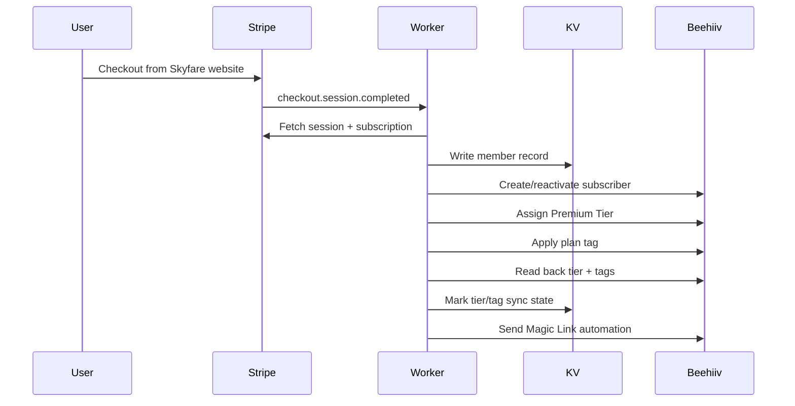
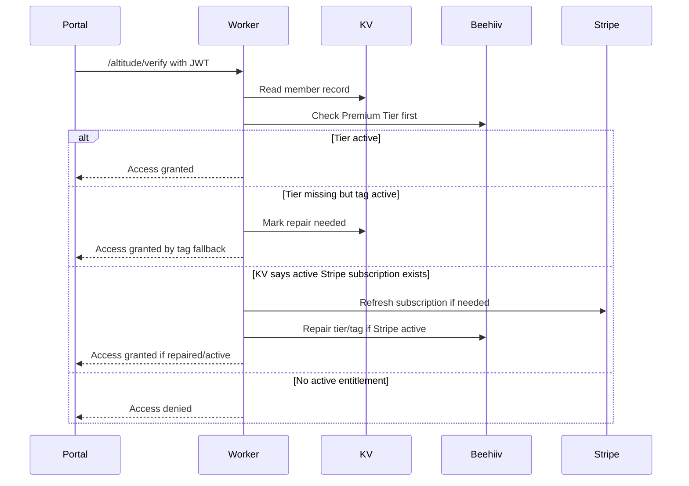
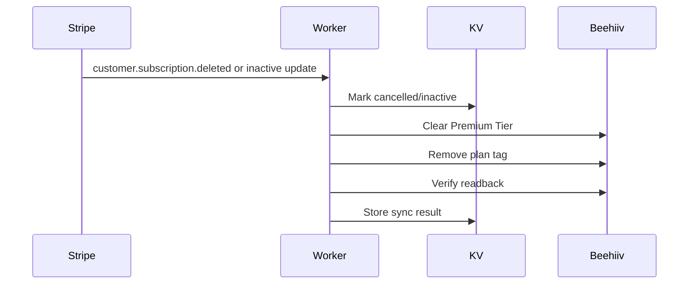

# Beehiiv Premium Tier Sync Design

Date: 2026-08-07

## Objective

Extend the existing Stripe -> Cloudflare Worker -> Beehiiv Tags -> KV -> Magic Link
flow so Beehiiv Premium Tiers recognize paying Altitude members, without
replacing the current production access system or adding a second checkout
path.

The updated access model is:

- Stripe remains the only payment processor and the billing source of truth.
- Beehiiv Premium Tier becomes the primary access signal for Altitude content.
- Beehiiv tags become secondary signals for fallback, segmentation, automation,
  and migration safety.
- Cloudflare KV remains the fast website entitlement cache and reconciliation
  ledger.
- The Skyfare website remains the primary member portal and login surface.

This is deliberately additive. Existing tags, magic links, portal routes,
Stripe Checkout, Stripe Billing Portal, and KV member records stay in place.

## Current Architecture Reviewed

Relevant production code:

- `cloudflare/orchestration/stripeWebhook.js`
- `cloudflare/orchestration/session.js`
- `cloudflare/orchestration/cron.js`
- `cloudflare/services/beehiiv.js`
- `cloudflare/services/stripe.js`
- `cloudflare/config/constants.js`
- `cloudflare/worker.js`
- `js/altitude.js`
- `js/altitude-portal.js`
- `pages/private-pages/altitude-access-portal.html`

The current system already handles Stripe checkout completion, monthly/annual
plan derivation, deferred Monthly -> Annual upgrades, cancellation, Beehiiv tag
sync, KV member records, Magic Links, JWT verification, and daily bundle expiry.
This design keeps those responsibilities intact.

## External API Facts

Beehiiv supports assigning Premium Tiers through the API:

- `POST /v2/publications/:publicationId/subscriptions` accepts `tier`,
  `premium_tiers`, `premium_tier_ids`, `stripe_customer_id`, `custom_fields`,
  and `automation_ids`.
- `PUT /v2/publications/:publicationId/subscriptions/:subscriptionId` accepts
  `tier`, `premium_tiers`, `premium_tier_ids`, `stripe_customer_id`,
  `unsubscribe`, and `custom_fields`.
- `GET /v2/publications/:publicationId/subscriptions/by_email/:email` can
  expand `subscription_premium_tiers`, `tags`, `custom_fields`, and
  `newsletter_lists`.
- `GET /v2/publications/:publicationId/tiers` returns tier IDs and status.

References:

- https://developers.beehiiv.com/api-reference/subscriptions/create
- https://developers.beehiiv.com/api-reference/subscriptions/put
- https://developers.beehiiv.com/api-reference/subscriptions/get-by-email
- https://developers.beehiiv.com/api-reference/tiers/index

Stripe webhook design constraints still apply:

- Stripe retries webhook delivery.
- Stripe can send duplicate events.
- Stripe does not guarantee event ordering.
- Webhook handlers must verify the raw request body signature.

Reference: https://docs.stripe.com/webhooks

Cloudflare KV design constraints still apply:

- KV is eventually consistent globally.
- Writes to the same key are limited to 1 write per second.
- Concurrent writes to the same key can overwrite each other.

Reference: https://developers.cloudflare.com/kv/api/write-key-value-pairs/

## Recommended Architecture

```mermaid
flowchart TD
  Site[Skyfare Website] --> Stripe[Stripe Checkout / Billing Portal]
  Stripe --> Worker[Cloudflare Worker]
  Worker --> KV[Cloudflare KV]
  Worker --> BeehiivTier[Beehiiv Premium Tier]
  Worker --> BeehiivTags[Beehiiv Tags]
  Worker --> BeehiivEmail[Beehiiv Automations]
  Site --> Verify[/altitude/verify]
  Verify --> KV
  Verify --> BeehiivTier
  Verify --> BeehiivTags
  Verify --> Stripe
```

### Source-of-truth model

There are two separate truths:

1. **Billing truth:** Stripe. Only Stripe decides whether money was paid,
   renewed, failed, cancelled, refunded, or expired.
2. **Access signal truth:** Beehiiv Premium Tier, mirrored from Stripe by the
   Worker. Website verification should prefer the Premium Tier signal once the
   migration is live.

KV ties them together. KV stores Stripe IDs, plan, status, expiration,
last sync result, and the latest observed Beehiiv tier/tag state. Tags remain
secondary fallback signals while the tier migration stabilizes.

This avoids a second subscription flow while still letting Beehiiv-native
premium content recognize paying members.

## Tier And Tag Mapping

Add Worker vars:

- `BEEHIIV_ALTITUDE_TIER_ID`
- Optional later: `BEEHIIV_GUIDE_TIER_ID`

Altitude should use one Beehiiv Premium Tier unless Beehiiv-native content
needs different paywalls for Monthly and Annual. Monthly vs Annual remains a
Stripe/KV plan field and a tag/segment distinction.

| Product state | Stripe | KV | Beehiiv Premium Tier | Beehiiv Tags |
|---|---|---|---|---|
| Monthly active | active subscription | `plan: monthly`, `status: active` | `BEEHIIV_ALTITUDE_TIER_ID` | `altitude monthly` |
| Annual active | active subscription | `plan: annual`, `status: active` | `BEEHIIV_ALTITUDE_TIER_ID` | `altitude annual` |
| Monthly -> Annual scheduled | active until period end | `plan: monthly`, `pending_plan: annual` | unchanged | `altitude monthly` until Stripe switches |
| Annual active after upgrade | active subscription on annual price | `plan: annual` | `BEEHIIV_ALTITUDE_TIER_ID` | swap to `altitude annual` |
| Cancelled but paid-through | Stripe status/cancel_at_period_end dependent | keep active until `current_period_end` if Stripe says paid-through | keep tier until access ends | keep tag until access ends |
| Ended/cancelled | deleted/inactive subscription | `status: cancelled` | clear tier / set free | remove interval tag |
| Guide one-time purchase | paid Checkout Session | `guide:{email}` active | optional only if Beehiiv paywall needs Guide content | `krisflyer` |
| Guide 90-day bundle | one-time purchase grants time-boxed access | `plan: guide_bundle`, active until `current_period_end` | `BEEHIIV_ALTITUDE_TIER_ID` until bundle expiry | `krisflyer bundle` |

## Data Flow

### New monthly or annual checkout



### Existing member verification



### Cancellation / expiration



## Worker Responsibilities

Add small Beehiiv helpers in `cloudflare/services/beehiiv.js`:

- `syncBeehiivAltitudeAccess(email, env, entitlement)`
- `assignBeehiivPremiumTier(email, env, tierId)`
- `clearBeehiivPremiumTier(email, env)`
- `getBeehiivAccessState(email, env)`
- `verifyBeehiivPremiumTier(email, env, tierId)`

Keep existing tag helpers. The sync helper should compose them rather than
rewrite current behavior.

`syncBeehiivAltitudeAccess` should:

1. Create or reactivate the Beehiiv subscriber.
2. Store `stripe_customer_id` when present.
3. Assign `BEEHIIV_ALTITUDE_TIER_ID` for active Altitude access.
4. Apply the matching secondary tag.
5. Remove stale interval tags when plan changes.
6. Read back `subscription_premium_tiers` and `tags`.
7. Return a structured sync result for KV.

On deprovision, it should:

1. Find the subscriber.
2. Clear Premium Tier by setting `tier: free`, then verify readback. If
   Beehiiv leaves tier membership unchanged, use empty `premium_tier_ids` as
   the fallback clearing method.
3. Remove plan tag.
4. Verify readback.
5. Return structured sync result.

## KV Responsibilities

Extend `member:{email}` records with sync metadata:

```json
{
  "email": "member@example.com",
  "status": "active",
  "plan": "annual",
  "stripe_customer_id": "cus_...",
  "stripe_subscription_id": "sub_...",
  "stripe_session_id": "cs_...",
  "current_period_end": "2026-09-07T00:00:00.000Z",
  "beehiiv_tier_synced": true,
  "beehiiv_tier_id": "tier_...",
  "beehiiv_tier_synced_at": "2026-08-07T00:00:00.000Z",
  "beehiiv_tagged": true,
  "beehiiv_tags": ["altitude annual"],
  "sync_error": ""
}
```

Add short-lived idempotency keys:

- `stripe-event:{event.id}` with 30-day TTL.
- Existing per-session email send guards stay as-is.

Avoid multiple writes to the same `member:{email}` key in one handler. Build
the final record in memory and write once where practical.

## API Flow Changes

### `checkout.session.completed`

Current behavior stays:

- Fetch full Stripe session.
- Derive plan from subscription.
- Write KV member record.
- Sync Beehiiv.
- Send Magic Link.

Change:

- Beehiiv sync now assigns Premium Tier first and tag second.
- KV records `beehiiv_tier_synced`.

### `customer.subscription.updated`

Current behavior stays:

- Refresh status and `current_period_end`.
- Detect monthly/annual price changes.
- Swap tags on plan change.

Change:

- Keep tier assigned for any active paid Altitude plan.
- If status changes to inactive, clear tier and remove tag.
- If plan changes, keep same tier but swap secondary tag.

### `customer.subscription.deleted`

Current behavior mostly stays:

- Mark KV cancelled.
- Remove plan tag.
- Activate deferred Guide bundle if applicable.

Change:

- Clear Premium Tier unless a deferred Guide bundle is activated.
- If Guide bundle activates, assign Altitude tier under `guide_bundle`.

### `invoice.payment_succeeded`

Current renewal email behavior stays.

Change:

- Optionally use renewal event as a repair point: ensure tier still assigned
  and KV period end current.

### `invoice.payment_failed`

Add lightweight handler:

- Fetch subscription or rely on event object if enough data exists.
- Mark `status: past_due` only if Stripe says so.
- Do not immediately revoke tier if Stripe still allows paid-through access.
- Reconcile on next `customer.subscription.updated` or daily sync.

## Access Verification Strategy

Update `getBeehiivEntitlements` to include Premium Tier state:

```js
{
  found: true,
  subscriber_active: true,
  premium_tier_ids: ["tier_..."],
  altitude_tier: true,
  tags: ["altitude annual"],
  altitude_monthly: false,
  altitude_annual: true
}
```

Verification order after migration:

1. Beehiiv Premium Tier active: grant access.
2. Secondary tag active: grant access, mark `tier_repair_needed`.
3. KV active with Stripe subscription ID: refresh Stripe, repair Beehiiv, then
   grant if Stripe confirms active/paid-through.
4. KV active without Stripe ID, such as valid `guide_bundle`: grant only if
   current period is in the future and repair tier if missing.
5. Otherwise deny.

This makes Premium Tier the primary website access signal while preserving
safe fallbacks during rollout.

## Synchronization Workflow

Use event-driven sync plus daily repair.

Event-driven sync:

- Runs on Stripe lifecycle webhooks.
- Handles the normal customer path immediately.
- Updates KV and Beehiiv together.

Daily repair:

- Runs in existing daily cron.
- Lists `member:*`.
- For each active paid subscription, fetches Stripe if `stripe_subscription_id`
  exists.
- Recomputes canonical entitlement.
- Repairs Beehiiv Premium Tier and tags.
- Clears access for expired Guide bundles.
- Logs mismatch counts.

Manual repair endpoint, admin-only:

- `POST /admin/reconcile-member`
- Input: email.
- Requires admin secret header.
- Recomputes Stripe/KV/Beehiiv state for one member.
- Useful for support without broad scripts.

## Edge Cases

- **Webhook redelivery:** skip if `stripe-event:{event.id}` already processed.
- **Webhook out of order:** handlers fetch fresh Stripe state before revoking
  access where possible.
- **Beehiiv API failure after Stripe success:** KV marks sync error; access can
  still be granted through Stripe/KV fallback; daily repair fixes tier.
- **Tier assigned but tag missing:** access granted; mark tag repair needed.
- **Tag assigned but tier missing:** temporary fallback grant; mark tier repair
  needed.
- **Cancelled but paid-through:** keep tier until actual access end if Stripe
  subscription still grants paid-through service.
- **Annual downgrade request:** use Stripe Billing Portal/support for now; no
  custom downgrade endpoint in this scope.
- **Monthly -> Annual scheduled upgrade:** tier does not change; tag changes
  only when Stripe switches the subscription price.
- **Guide bundle expiry:** daily cron removes tag and clears tier.
- **Manual Beehiiv edit:** daily repair restores Beehiiv to Stripe/KV state.
- **Unsubscribed Beehiiv subscriber:** reactivation only happens for paying
  members, matching current payment fulfillment behavior.

## Security Considerations

- Keep Stripe as the only checkout path.
- Keep Stripe webhook signature verification on raw body.
- Add constant-time comparison for manual Stripe signature verification.
- Store Beehiiv tier IDs in Worker vars, not hardcoded literals scattered in
  code.
- Store API keys as Worker secrets only.
- Rate-limit magic links, checkout, verify, and admin repair routes.
- Admin repair route requires secret header and should not expose raw Stripe or
  Beehiiv payloads.
- Magic links remain one-hour TTL.
- Do not trust client-provided `session_id` without Stripe verification.
- Do not grant permanent website access from Beehiiv tag alone after the
  migration window, unless Stripe/KV fallback confirms an active entitlement.

## Implementation Steps

1. Add Beehiiv tier IDs to Worker vars.
2. Add constants for `BEEHIIV_ALTITUDE_TIER_ID` lookup.
3. Extend Beehiiv entitlement readback to include `subscription_premium_tiers`.
4. Add `syncBeehiivAltitudeAccess` helper that assigns tier and secondary tag.
5. Replace `setupBeehiivMember` call sites gradually with the new sync helper,
   preserving current tag behavior inside the helper.
6. Add deprovision helper to clear tier and remove tag.
7. Add Stripe event dedupe keys.
8. Add `invoice.payment_failed` handling.
9. Update `/altitude/verify` to prefer Premium Tier, then tags, then KV/Stripe
   repair fallback.
10. Extend daily cron with tier/tag reconciliation.
11. Add one-email admin reconciliation endpoint.
12. Run live-mode-safe test cases with test subscribers before broad migration.

## Testing Plan

Manual and targeted Worker tests:

- New Monthly checkout: tier assigned, monthly tag assigned, magic link sent,
  portal access granted by tier.
- New Annual checkout: tier assigned, annual tag assigned, magic link sent,
  portal access granted by tier.
- Monthly -> Annual scheduled upgrade: tier unchanged, monthly tag remains
  until Stripe phase boundary.
- Monthly -> Annual effective switch: annual tag replaces monthly tag, tier
  remains assigned.
- Cancellation paid-through: access remains until actual end if Stripe still
  indicates service period.
- Subscription deleted/ended: tier cleared, tag removed, portal access denied.
- Beehiiv tier missing but tag present: portal grants temporarily and repairs
  tier.
- Beehiiv tag missing but tier present: portal grants and repairs tag.
- Beehiiv API outage: Stripe checkout still records KV sync error; daily repair
  later fixes Beehiiv.
- Replayed Stripe webhook: no duplicate emails and no duplicate side effects.
- Guide bundle active: tier assigned until bundle end.
- Guide bundle expired: cron clears tier/tag and denies Altitude access.

## Scalability Recommendations

- Keep event-driven sync synchronous enough to fulfill access, but keep repair
  and non-critical verification as background-safe operations.
- Do not add a queue unless webhook volume grows enough to hit Worker or
  Beehiiv rate limits. Current site scale does not justify it.
- Keep KV records compact and one-member-per-key.
- Avoid frequent full Beehiiv scans; reconcile from KV member keys instead.
- Use cursor pagination only where full Beehiiv listing is unavoidable.
- Prefer one Beehiiv Premium Tier for all paid Altitude members unless content
  needs separate Monthly/Annual Beehiiv paywalls.

## Out of Scope

- Replacing Stripe with Beehiiv checkout.
- Moving the member portal into Beehiiv.
- Removing tags immediately.
- Building a custom database or queue service before volume requires it.
- Creating separate Monthly and Annual Beehiiv Premium Tiers unless Beehiiv
  content access requires different paywalls.
- Reworking existing Magic Link or portal UI behavior.

## Final Decision

Proceed with Beehiiv Premium Tier as the primary access signal and Beehiiv tags
as secondary signals. Stripe remains the billing authority. KV remains the
website cache, audit trail, and repair ledger.

This gives Beehiiv-native premium content what it needs without disrupting the
current production system.
