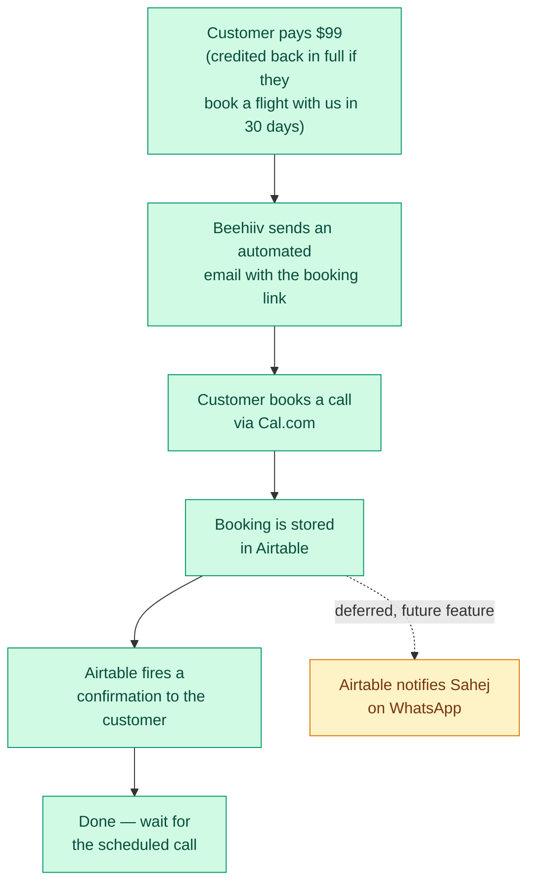

# Travel Strategy Call — How It Works

A simple walkthrough of what happens from the moment someone pays $99 to the moment they show up for their call.

## What each step means

1. **Pays $99** — one-time payment. If they end up booking a real flight with us within 30 days, that $99 is credited toward it — not lost.
2. **Automated email** — Beehiiv sends this right after payment, with the button to book a slot.
3. **Books a call** — customer picks a time on Cal.com.
4. **Stored in Airtable** — the booking lands in our records automatically.
5. **Confirmation to customer** — Airtable fires this off, no manual step needed.
6. **Admin WhatsApp notification** — not built yet, on purpose. A future feature: Sahej gets pinged on WhatsApp the moment someone books, instead of checking the calendar himself.
7. **Done** — nothing more needed until the scheduled call.
